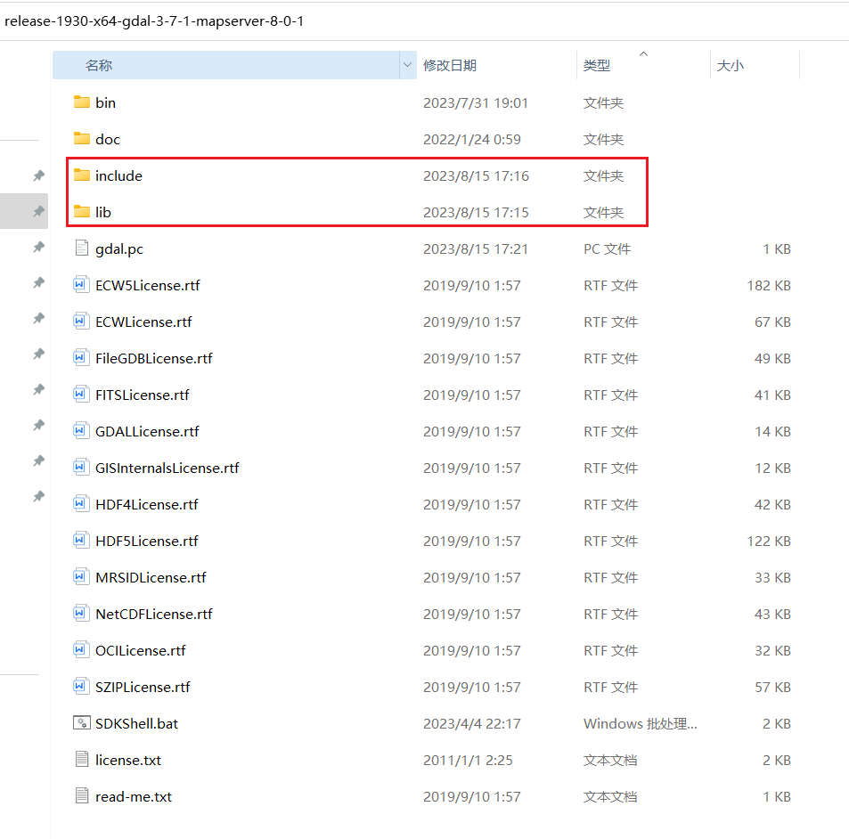

## Windows Install Rust Version Gdal Steps [github repository](https://github.com/aliothor/Windows-Install-Rust-Gdal-Tutorial)

English | [简体中文](./README_zh_CN.md)

#### 1、Download the gdal c++ compiled source code and place it in the same folder.

> https://www.gisinternals.com/release.php




### 2、Set environment variables, note the GDAL version.

// windows path system environment variable
Path:C:\xxxxxx\gdal_lib\release-1930-x64-gdal-mapserver\\bin
Path:C:\xxxxxx\gdal_lib\release-1930-x64-gdal-mapserver\\bin\\gdal\\apps

// windows global system environment variable
GDAL_HOME=C:\xxxxxx\gdal_lib\release-1930-x64-gdal-mapserver
PKG_CONFIG_PATH=C:\xxxxxx\gdal_lib\release-1930-x64-gdal-mapserver
PROJ_LIB=C:\xxxxxx\gdal_lib\release-1930-x64-gdal-3-7-1-mapserver-8-0-1\bin\proj9\share
GDAL_VERSION=371

### 3、Install choco and pkgconfiglite (windows pkg-config).

> https://github.com/chocolatey/choco/releases

```bash
choco install pkgconfiglite
```

### 4、Check the gdal version.

```bash
gdalinfo --version
// GDAL 3.7.1, released 2023/07/06(configured correctly, the command line will print this content)
```

### 5、Write the gdal.pc file, note the Version:3.7.1 should be the same as the fourth step.

gdal.pc file path C:\xxxxxx\gdal_lib\release-1930-x64-gdal-mapserver\gdal.pc

gdal.pc file content

```text>
name=gdal
prefix=/usr
exec_prefix=${prefix}
libdir=${exec_prefix}/lib
includedir=${exec_prefix}/include
datadir=${prefix}/share/${name}

Name: lib${name}
Description: Geospatial Data Abstraction Library
Version: 3.7.1
Libs: -L${libdir} -l${name}
Cflags: -I${includedir}/${name}
```


### 6、Run the official examples or clone this project.
> https://github.com/georust/gdal

```bash

cargo run --example metadata
```

#### RoadMap
Submit the code to the rust gdal official repository.