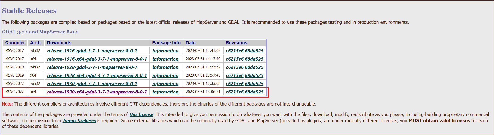

## Windows安装Rust版本Gdal步骤 [github地址](https://github.com/aliothor/Windows-Install-Rust-Gdal-Tutorial)

### 1、下载gdal c++编译后源码，将解压后的的文件放在同一个文件夹内

> https://www.gisinternals.com/release.php




### 2、设置环境变量,注意gdal版本

```shell
// windows path系统环境变量
Path:C:\xxxxxx\gdal_lib\release-1930-x64-gdal-mapserver\\bin
Path:C:\xxxxxx\gdal_lib\release-1930-x64-gdal-mapserver\\bin\\gdal\\apps

// windows 全局系统环境变量
GDAL_HOME=C:\xxxxxx\gdal_lib\release-1930-x64-gdal-mapserver
PKG_CONFIG_PATH=C:\xxxxxx\gdal_lib\release-1930-x64-gdal-mapserver
PROJ_LIB=C:\xxxxxx\gdal_lib\release-1930-x64-gdal-3-7-1-mapserver-8-0-1\bin\proj9\share
GDAL_VERSION=371
```

### 3、安装choco和pkgconfiglite(windows pkg-config)

https://github.com/chocolatey/choco/releases

```bash
choco install pkgconfiglite
```

### 4、查看gdal版本
```bash
gdalinfo --version
// GDAL 3.7.1, released 2023/07/06(配置正常时命令行打印此内容)
```

### 5、写入gdal.pc文件,注意***Version:3.7.1*要和第四步相同

> gdal.pc文件路径 C:\xxxxxx\gdal_lib\release-1930-x64-gdal-mapserver\gdal.pc

gdal.pc文件内容
```txt
name=gdal
prefix=/usr
exec_prefix=${prefix}
libdir=${exec_prefix}/lib
includedir=${exec_prefix}/include
datadir=${prefix}/share/${name}

Name: lib${name}
Description: Geospatial Data Abstraction Library
Version: 3.7.1
Libs: -L${libdir} -l${name}
Cflags: -I${includedir}/${name}
```

### 5、运行官方示例或clone此项目

> https://github.com/georust/gdal

```bash
cargo run --example metadata
```